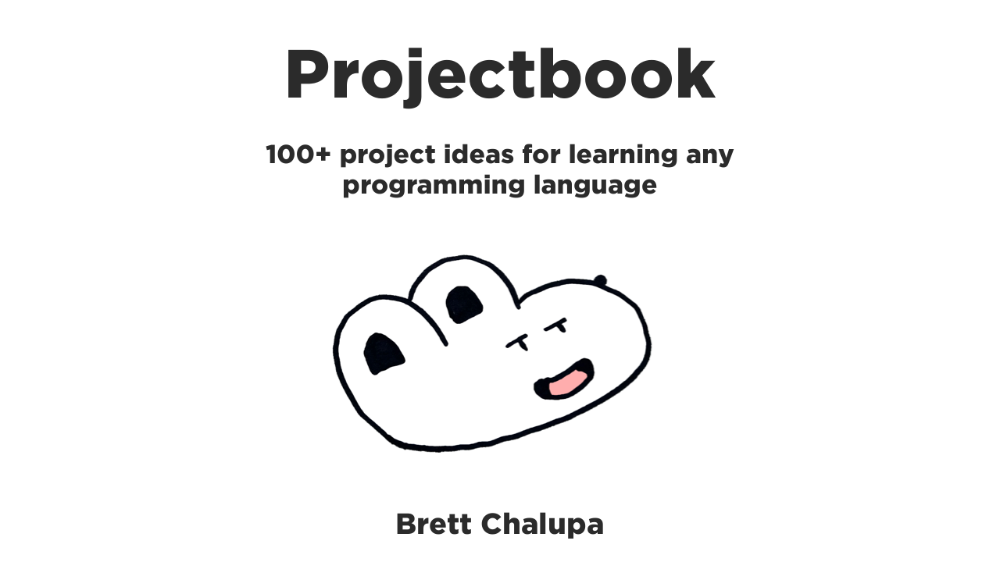

# Projectbook Introduction

**Learn By Doing**

~or~

**The Great Big List of Software Project Ideas**

_Projectbook_ is a collection of over 100 software project ideas for people looking to learn a given language or technology but short on inspiration for what to build. These projects tend to vary in complexity and what they exercise.

My goal with this collection is to provide detailed enough specifications to get you started on a project.

I've found that a lot of software tutorials are too simple and basic and that I only really learn through building something.

When learning a new programming language or library or technology, there's so much to take in that having to figure out what to build and what it should and shouldn't do can be enough friction to slow down any momentum and fun you're having.

In a lot of ways, these projects are just me sharing software and tools that I want to build myself.

Often a simple todo app is the non-trivial example project that people point to. It's a fine one because it has a variety of needs and state management. But it's so boring! And overdone! So these are the ideas beyond the todo list app.

## What Makes a Good Learning Project

- Non-trivial -- more complex than "hello world" but less complex than a video editor
- A simple core with additional, more complex functionality to add
- Clear in what it does and doesn't do
- Something you understand from using yourself so you can more easily map the domain into code

## Project Schema

The projects in _Projectbook_ attempt to conform to a similar shape:

- **The gist**: a quick introduction to the project
- **Spec**: short for specifications; the functionality written out
- **Concepts**: aspects of development the project exercises
- **Resources**: anything that might be helpful, from assets to tutorials
- **Mock-Ups**: low fidelity designs for the project
- **Examples**: open source projects similar to the project
- **Extra Credit**: ideas for where to take the project beyond the initial specs
- **See Also**: related projects in _Projectbook_

## Mindset

Please, please, please don't go into these projects thinking, "Wow, this idea is going to make me rich! It's the next start-up! It's the next big thing! Get those angel investors on the line!" I fall into this trap from time to time, especially when I'm dreaming big. I start thinking about monetization and hosting and the viability of something existing as a business. What you're trying to do is learn! Not start a business. Don't burden yourself with the responsibility of doing anything other than experimenting at the beginning.

If you were to learn how to play guitar and you're playing simplified covers of your favorite songs, which is basically what we're doing here, would you start by thinking about how you'll record, mix, master, and release your cover album to make you rich? No! You'd practice them, play them for friends, maybe record them. Maybe one day you'd be in a cover band. Or even start writing your own original music. But don't concern yourself with anything other than learning and having fun right now.

When it comes to the user experience (UX) (the flow through your program) and user interface (UI) (the look of your program), look at similar programs and how they work. Your best bet is to take some time to do research and gather reference. Pay attention, take screenshots, and make note of how the apps work.

It is totally normal and okay to start learning projects and never finish them. That's part of the process. Don't be too hard on yourself if you lose interest in a given project. Try another one. But remember: there's value in finishing things. Finished projects, apps, programs, tools, and libraries are of use to yourself and likely others. Completing and launching projects is its own skill set. Try to be a Finisher! That's why working on smaller ideas to start is important because there's a much higher chance you'll finish them.

## Reading Order

The order of the chapters in each section is loosely based on my perceived difficulty of them. My judgment may be off in some cases, but I think that's a pretty good bet.

[Command Line Interfaces (CLIs)](./command-line-interfaces/_introduction.md) are first because I think they're generally a nice place to start because they don't require graphic rendering and a GUI. This makes their interfaces quite a bit simpler since there are only so many forms of input and output.

Some types of projects won't make sense for certain technologies. If you want to learn HTML, then ideas for CLIs won't be much help for you. Check out [Websites](./websites/_introduction.md) instead.

However, don't read this book as you would a normal linear book. It's instead meant to be a place to browse around, experiment, find inspiration, and start hacking away and learning.

## Wireframes & Design Assets

For projects with a GUI, it can be daunting to think about what it will look like and even potential assets.

Not a designer? That's totally okay!

Throughout the projects, you'll find wireframes, specs, and assets. You're welcome to use them or disregard them. Whatever you want. It's your project! Your learning. I'm just trying to help.

The nice thing about building GUI apps is that there are lots of graphical libraries and toolkits that you can utilize without designing or coding them from scratch, from things like GTK to Apple's platforms' various libraries to Material Design to Bootstrap.

Don't worry too much about it looking generic or boring when you're learning, unless what you're learning is how to polish a GUI! It really depends on what you want to get out of your project. Whether you use libraries or existing code or do it all from scratch.

## Who the Heck Am I?

I am Brett! Nice to meet you. Thanks for checking this out. I'm a software programmer who has been doing some form of coding since I was 13. Professionally, I build web applications and APIs with Ruby, Rails, TypeScript, GraphQL, and web components. Personally, I dabble with all sorts of programming, from CLIs to game dev. I like checking out new languages and frameworks on the regular.

Since I'm not, let's say, a software programmer for smart refrigerators, there aren't a ton of ideas related to smart refrigerators. The focus is more on the software I use regularly or have to build. This is great because I understand the needs and functionality, which means I don't have to think too much about why something needs to do something and can instead focus on learning the technology.

I'd love to have more project ideas for different types of programming, like network programming and embedded hardware and such. Hopefully in the future!

Want to connect or follow along with other things I do?

- [Check out my website](https://code.brettchalupa.com)
- [Follow me on Twitter @brett_codes](https://twitter.com/brett_codes)
- [Watch my screencasts](https://www.youtube.com/channel/UCQXaIyeRqHjK9EK41b8J3yQ)

## Rights & License

Anyone is welcome to use the project ideas in this book to build software and try to make money if that's your aim. Best of luck.

I hope most of all that you have fun and learn with these ideas. But if you build the Next Big App or whatever from one of these ideas, kudos to you.

Ideas aren't worth much. What matters is what you make from those ideas!

There are three aspects of _Projectbook_ that fall under different usage rights and licensing.

### Content

The written text and visual assets (mock-ups) in the book are licensed under a [Creative Commons Attribution-NonCommercial-ShareAlike 4.0 International License](http://creativecommons.org/licenses/by-nc-sa/4.0/) unless otherwise noted.

### The Project Ideas

Anyone is welcome to use the project ideas in this book to build software without any credit needed to _Projectbook_.

### Code Snippets in the Book

Anyone is free to copy, modify, publish, use, compile, sell, or distribute software containing the code snippets included within the book, either in source code form or as a compiled binary, for any purpose, commercial or non-commercial, and by any means.

### See LICENSE

[Read more about the specific license aspects of the book.](https://github.com/brettchalupa/projectbook/blob/main/LICENSE.md)

## Contributing

Do you have an idea for a project? [Contribute it!](https://github.com/brettchalupa/projectbook) _Projectbook_ is open source and editing its contents is easy. Just find the project's Markdown file, edit it, and open up a Pull Request on [the project's GitHub repository](https://github.com/brettchalupa/projectbook).

Did you code an open source version of one of the projects and want to share the source to help others? Well, add it in a pull request! Your project will be a helpful reference for those that are stuck. Who knows, you might find some people to contribute and help you out.

## Dig In!

View the projects in the sidebar or browse through the sections below to find a project that catches your interest. Then hack away and make some cool things! Learn a lot. And share what you make.

- [CLIs](./command-line-interfaces/_introduction.md)
- [Libraries](./libraries/_introduction.md)
- [Websites](./websites/_introduction.md)
- [Web Components](./web-components/_introduction.md)
- [Web Apps](./web-apps/_introduction.md)
- [General GUIs](./general-graphical-apps/_introduction.md)
- [Games](./games/_introduction.md)
