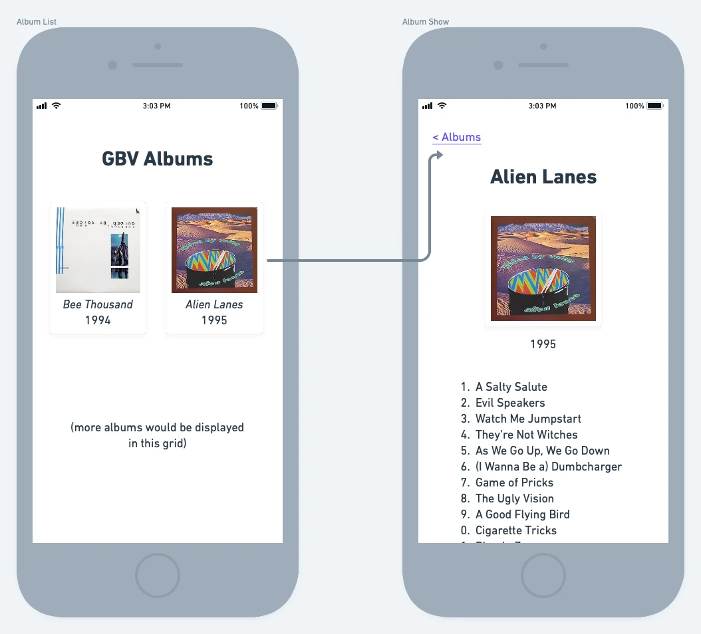

# Client App

**The gist**: build out a graphical interface for reading and rendering data from a public API.

Whether building a desktop app, a native app, or a web app, a really common need is being able to fetch data from an HTTP API and render that data.

## Spec

- Stand-up your GUI app
- Fetch data from the API
- Render it!

## Resources

- [Read-Only API project](../web-apps/read-only-api.md) — if you built a read-only API, even one you just run locally, you could build your client app to read that data
- [public-apis List on GitHub](https://github.com/public-apis/public-apis) — helpful reference for similar examples

## Concepts

- Consuming an HTTP API
- Data-driven UI
- Translating API data into data structures in your client language

## Examples / Mock-Ups

To continue with the _Guided By Voices_ discography example from the Read-Only API project, the client app would render the album details and allow the songs to be viewed. Here's a mock-up of what that could be like:

## Technologies of Interest

- Any web component framework like Svelte, React (Next.js in particular), Lit, Stencil, Vue, etc.
- [gtk-rs](https://gtk-rs.org) for building a desktop GUI
- [Flutter](https://flutter.dev) with [Dart](https://dart.dev)
- Swift for Apple platforms

## Extra Credit

- Cache (store) the results locally so the application can work offline
- Make your UI handle long strings nicely, this is a common issue

## See Also

- [Read-Only API](../web-apps/read-only-api.md) — building out an API that could be consumed
- [API Wrapper](../libraries/api-wrapper.md) — writing a wrapper for an API (your API if you want) to make it easier to work with
