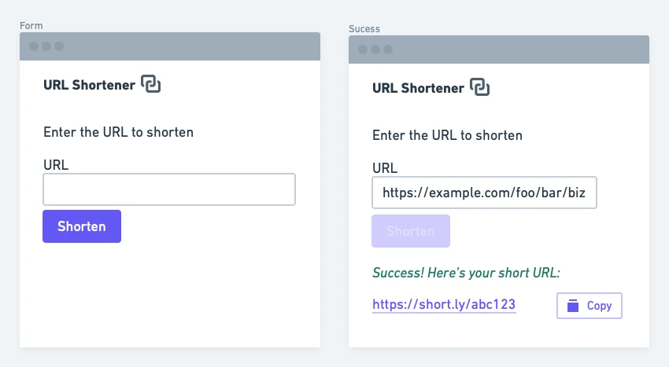

# URL Shortener

**The gist**: Allow users to create short versions of links to make them easier to speak and share.

For example, https://some.place.example.com/foo/bar/biz being shorted to https://short.ly/abc123

Having a short URL can be nice for making it easier for people to type it in, whether hearing it on a podcast or reading it on a poster. Sure, QR codes sort of stole the show for the latter use case, but it's still a good learning project!

## Mock-Ups

Here's what the simple interface could look like:

## Spec

- Build a web page with a form for entering a URL
- When the form is submitted, return a shortened version of the URL
- Ensure the slug of the URL (abc123 in the example above) is unique
- When the shortened URL is accessed, redirect to the stored URL
- If an invalid slug is accessed, display a 404 Not Found page

## Concepts

- Accepting & validating input
- Algorithm design
- Storing & fetching data
- Responding to requests & redirecting

## Extra Credit

- Validate the entered URL is actually a URL
- Make it easy to copy the generated URL to the clipboard
- Calculate the max number unique slugs that can be generated from your algorithm
- Allow users to edit the slug of the generated URL
  - Ensure the slug is unique
- Add support for accounts so people can view the short URLs they created
- Track the visits to the short URL and surface to the owner

## Reference

- [bit.ly](https://bit.ly) — the long-standing URL shortener!
- [TinyURL](https://tinyurl.com/app) — another long-standing one
